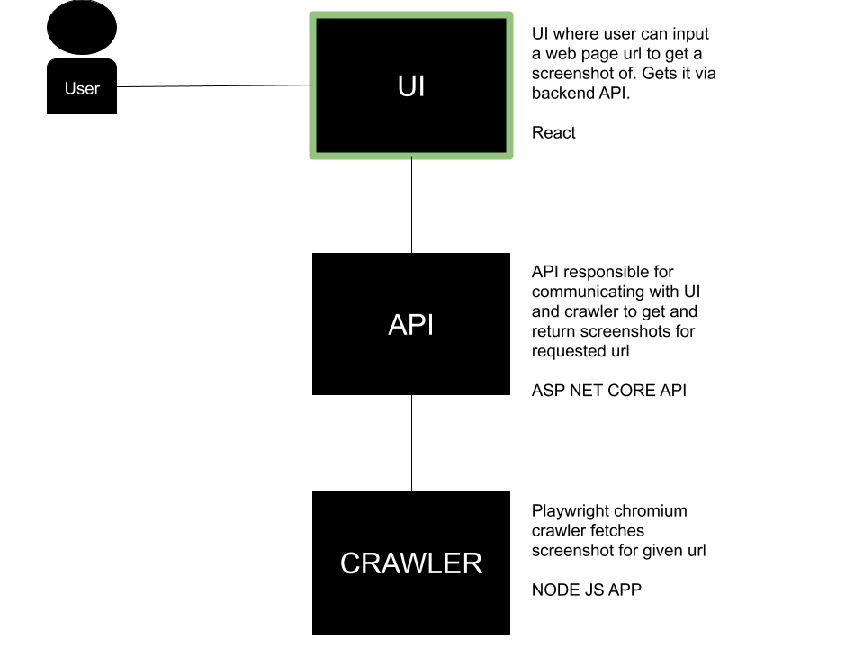

This project was bootstrapped with [Create React App](https://github.com/facebook/create-react-app).

In the project directory, you can run:

### `npm start`

Runs the app in the development mode. 
Open [http://localhost:3000](http://localhost:3000) to view it in the browser.

The page will reload if you make edits. 
You will also see any lint errors in the console.

### `npm test`

Launches the test runner in the interactive watch mode. 
See the section about [running tests](https://facebook.github.io/create-react-app/docs/running-tests) for more information.

### `npm run build`

Builds the app for production to the `build` folder. 
It correctly bundles React in production mode and optimizes the build for the best performance.

The build is minified and the filenames include the hashes. 
Your app is ready to be deployed!

See the section about [deployment](https://facebook.github.io/create-react-app/docs/deployment) for more information.

## Architecture
This react app makes up the UI for the "demo crawler" app which is structured as:

## Implemented in this demo
- [x] Screenshot support via Chromium browser
- [ ]  Google lighthouse report
- [x] Material UI
- [ ]  Typescript
- [ ]  ?

### TODOs
- [ ]  Refactor pageResultWrapper component - too big and messy
- [ ]  Look over error handling and clean it up.
- [ ]  Add unit tests
- [ ]  Break out API url to config file instead (even if local vs heroku is used in local dev too when testing)